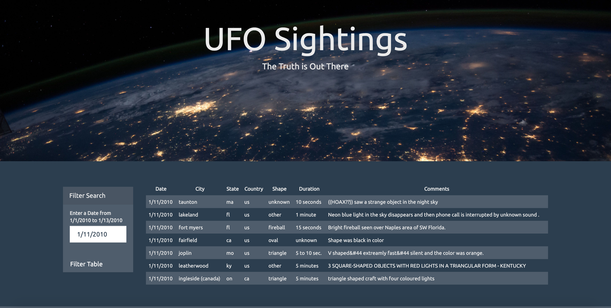
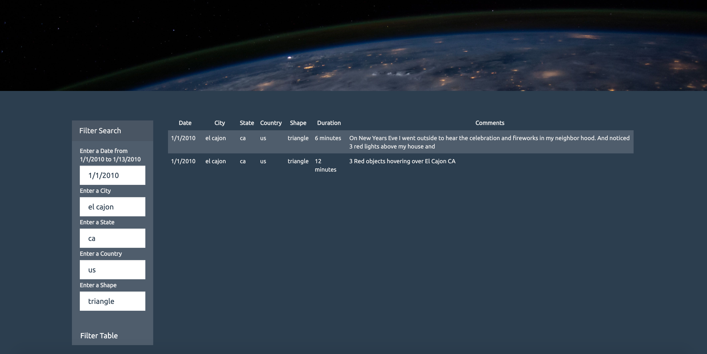

# JavaScript Challenge

## Task

To create a webpage that presents eye-witness reports of extra-terrestrial activity in a way that is easy to navigate. This involves writing code that dynamically creates a table based upon a dataset where sightings are in the form of an array of JavaScript objects. The table populate with reports based on dates or features selected by the user.

## Technologies 

- JavaScript
- HTML
- CSS
- D3.js

## Level 1

Creates a table with a column for `date/time`, `city`, `state`, `country`, `shape`, and `comment` based on a date selected by the user. 

## Level 2

Uses multiple `input` tags so the user can to set multiple filters and search for UFO sightings using the following criteria:

1. `date/time`
2. `city`
3. `state`
4. `country`
5. `shape`

## Viewing

The webpages can be used on a local machine by opening the `index.html` file in the appropriate folder: `UFO-level-1` or `UFO-level-2`. 
